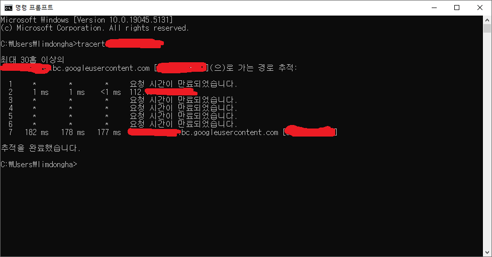
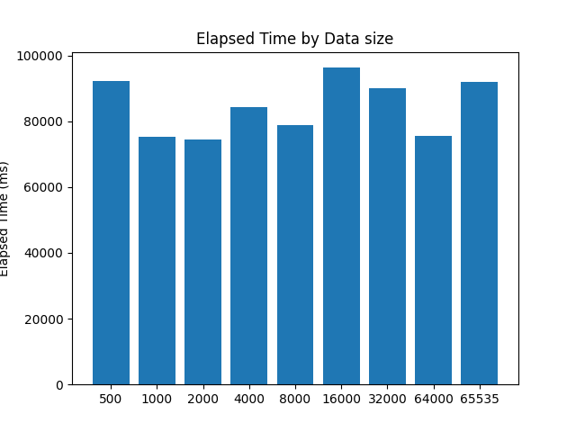
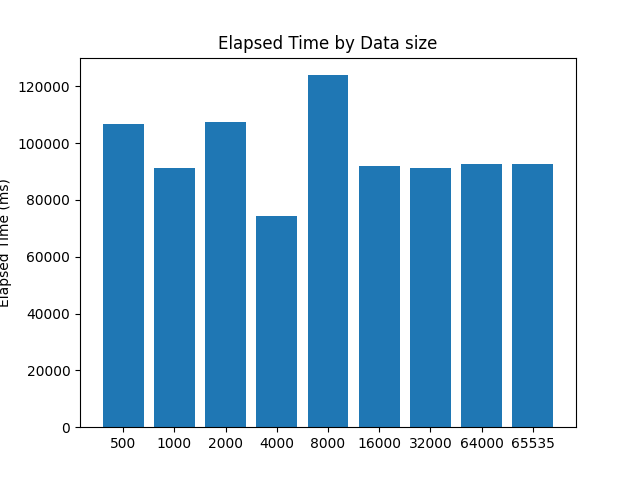
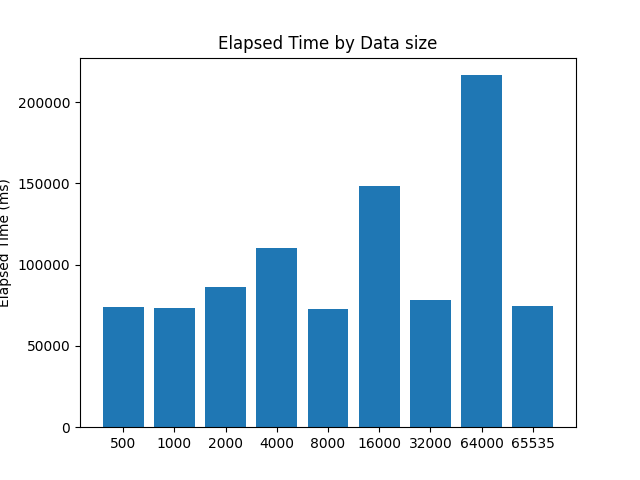
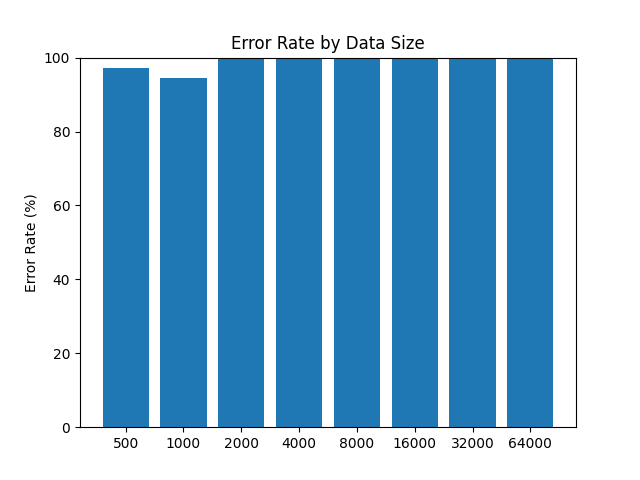
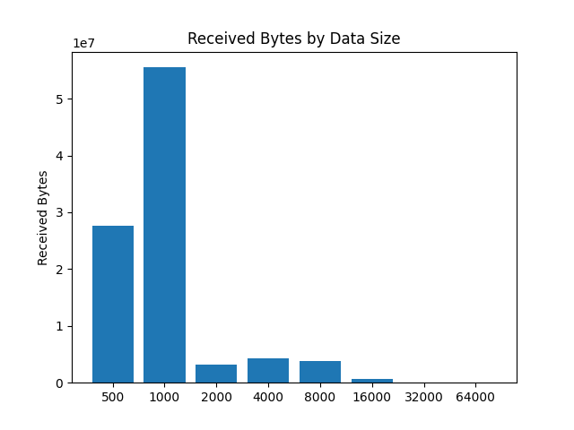

## 이 리포지토리의 목적 

이 리포지토리는 다음 두 실험을 위한 프로그램을 작성하기 위한 리포지토리이다. 

1. TCP를 사용할 때, 보내는 데이터의 단위에 따라 전송하는 데 걸리는 시간이 얼마나 걸리는 지 측정한다.

2. UDP를 사용할 때, 보내는 데이터의 단위에 따라 에러가 발생하는 정도는 어떻게 변화하는 지 측정한다.

두 실험 모두, 전송하는 데이터의 단위를 500바이트에서 65535바이트까지 변화시켜가며 
1GB의 데이터를 전송한다. 

이상의 실험을 위해 TCP 클라이언트와 서버, UDP 클라이언트와 서버를 제작한다.

실제 환경에서의 변화를 측정하기 위하여 Google Cloud의 VM 인스턴스를 사용한다. 

## 테스트 환경을 위한 유틸리티 클래스 

TCP 테스트와 UDP 테스트 양쪽에서 공통으로 사용할 정적 유틸리티 메소드를 가질 
유틸리티 클래스들을 정의한다. 

코드의 재사용성을 높여 환경 통제를 쉽게하기 위함이다.

공통으로 사용될 로직은 아래와 같다. 

1. 테스트용 데이터 단위 반환 
2. 서버 주소와 포트 번호 입력 
3. 시간 측정 
4. 실험 결과 파일 출력 
5. 환경 확인을 위한 tracert 실행 후 파일 출력 알고리즘

(상세 코드는 리포지토리 참조)

```java
package org.limdongha.util;
//......
/**
 * 테스트를 위해 사용할 정적 유틸 클래스
 * @author limdongha
 */
public class TestUtils {
    //......
}
```

```java
package org.limdongha.util;
//......
/**
 * 시간 측정을 위한 클래스
 * @author limdongha
 */
public class Timer {
    //......
}

```

```java
package org.limdongha.util;
//......

/**
 * CSV 파일을 편리하게 작성하기 위한 클래스 <br/>
 * write 할 모든 클래스는 CsvConvertible 을 구현하고,
 * 열의 갯수가 일치해야 하며, 열 이름을 반환할 수 있어야 한다. (열 이름 일치는 검사하지 않음)
 * @author limdongha
 */
public class CsvWriter<T extends CsvConvertible> implements Closeable, AutoCloseable, Flushable {
    //......
}
```


## TCP

### 실험 목적과 예상 

어플리케이션에서 TCP 소켓으로 보내는 데이터의 단위가 전송 속도에 어떠한 영향을 미치는 지 
측정해본다. 

먼저 데이터의 단위 크기가 속도에 미치는 영향들을 예상해보자.

1. 데이터가 작을 경우
   - TCP와 IP의 헤더 파일이 전체 패킷에서 차지하는 비율이 상대적으로 커질 것이다. (오버헤드)
   - 대역폭을 효율적으로 사용하지 못할 가능성이 높다.
   - 어플리케이션에서 전송을 요청하는 횟수가 증가하므로 CPU 사용량이 더 높을 것이다. 
   - ACK 패킷 수가 증가로 인한 오버헤드가 생긴다. 
   - IP 파편화가 발생할 가능성이 낮아진다. 
2. 데이터가 클 경우 
   - 전체 패킷에서 헤더가 차지하는 비율이 상대적으로 작다. 
   - 대역폭을 효율적으로 사용할 수 있다. 
   - 전송 요청 횟수가 상대적으로 적어 CPU 사용량이 더 낮을 것이다.
   - ACK 패킷 수가 상대적으로 적어진다. 
   - IP 파편화가 발생할 가능성이 상대적으로 높다. 이는 중간 노드들의 상태에 따라 달라진다.
   - 파편화가 발생할 경우, 패킷이 많아지므로 혼잡 제어가 작동할 확률이 높아져 느려질 수 있다.
   - 패킷이 손실될 경우 재전송해야 하는 데이터의 크기가 커진다. 즉, 한번 손실될 때의 타격이 커진다.

크지도, 작지도 않은 적절한 값이 최소한의 전송 속도를 보여줄 것으로 예상된다. 

실제 실험을 통해 해당 값이 어느 정도인지 알아보자. 

### 변인 통제 - 파일 입출력 

만약, 테스트를 위한 데이터를 디스크에서 로드할 경우, 
파일 입출력 속도가 실험 결과에 영향을 미칠 수 있다. 

파일 입출력에 걸리는 속도가 네트워크 지연 차이보다 커서 
차이를 알기 어렵게 할 수 있는 것이다. 

TCP 실험에서는 **단순히 전송 속도**만 보면 된다. 
이미 TCP 자체가 신뢰성을 보장해주기 때문에 **파일 내용은 상관이 없다.** 
고려해야 할것은 전송한 데이터의 바이트 수와 전송 속도이다. 

따라서 TCP 실험에 한해서는 테스트 데이터를 파일에서 로드하는 것이 아닌, 
직접 메모리에 있는 임의의 데이터(0~255의 숫자와 같은)를 바이트 수만 맞춰서 
전송한다. 

### TCP 클라이언트 - 설계 

클라이언트의 흐름은 다음과 같다. 

1. 환경을 확인하기 위해 `tracert` 실행하고 파일로 출력
2. 전송할 단위 크기 설정
   - 실험에서의 "변수"에 해당한다. 해당 값이 변함에 따라 속도의 차이가 얼마나 나는지 측정해야 한다.

3. 데이터 로드
   - 버퍼에 담긴 0~255의 숫자를 반복해서 전송할 것이다. (`new byte[65535]`)

4. 서버와 연결
   - TCP 소켓을 사용해서 TCP 서버에 연결한다.

5. 데이터 전송 후 시간 측정
   - 전송하기 직전에 시작 시간을 기록한다. (`System.nanoTime()`, `System.currentTimeMillis()` 등)
   - 단위 크기만큼 데이터를 읽어서 서버로 전송한다.
        - 전송 완료 시, 전송 완료 시간을 기록한다.
        - (완료 시간 - 시작 시간)을 계산해서 데이터 크기 단위와 계산한 시간을 `List`에 `record` 형태로 기록한다.

6. 모든 과정이 완료되면, 실험 결과를 `CSV`파일에 기록한다. 


### TCP 서버 - 설계 

1. TCP 서버 소켓을 bind 한다.
   - 지정된 포트로 소켓을 연다.

2. 클라이언트가 연결 요청을 하면 수락한다.

3. 데이터를 받는다.
   - 데이터를 받고, 받은 데이터의 바이트 수를 합산한다. (받은 데이터는 필요없으니 버린다.)

4. 파일 전송이 완료되면, 실험 결과를 `CSV` 파일에 기록한다.


### TCP 실험 프로그램 설계 과정 (계획, 기록) 

먼저 사용할 Java 모듈들에 대해 숙지하자. 

먼저 소켓 통신이므로 `ServerSocket`과 `Socket`을 사용한다. (실험이므로, 간단한 IO 기반으로 한다. NIO 기반은 단순 실험으로는 과하다.)

[Java ServerSocket 공식 문서](https://docs.oracle.com/javase/8/docs/api/java/net/ServerSocket.html)

[Java Socket 공식 문서](https://docs.oracle.com/javase/8/docs/api/java/net/Socket.html)

그리고 파일 입출력을 위한 `FileInputStream`, `BufferedWriter` 등의 입출력 관련 스트림과 보조 스트림을 사용한다. 

또한 파일로 결과를 저장하기 위해 `record`를 적극 활용한다. 

[Java record 업데이트 문서](https://docs.oracle.com/en/java/javase/14/language/records.html#GUID-6699E26F-4A9B-4393-A08B-1E47D4B2D263)

일단은 클라이언트와 서버 각각 `main` 메소드를 가진 단일 클래스 구조로 한다. 
아직은 단순한 실험이기 때문이다. **나중에 필요하다면 클래스로 분리하고 멀티 스레딩을 도입한다.(스레드 풀 등)**

### TCP 클라이언트 - 제작 

(실제 코드는 리포지토리의 `TcpClient.java`를 참조바란다.)

`TestUtils`에 정의한 `getSocketAddressFromStdIn()` 메소드를 사용하여 
사용자로부터 접속할 서버의 소켓 정보를 입력받는다. 이는 여러 실험 환경에서 테스트할 때의 
편의성을 위함이다. 

마찬가지로 `TestUtils`의 `getDataSizes()`를 사용하여 실험의 "변수"에 해당하는 
데이터 단위들을 `List`로 받아온다. 기본적으로 `{500, 1000, 2000, ..., 65535}`의 값으로 구성되어 있다. 
만약, 단위를 변경해야 한다면 해당 메소드를 수정하면 될 것이다. 

실험 결과를 저장할 `List`를 `TestRecord` 타입으로 선언한다. 

이후, 실험 로직은 크게 아래와 같은 과정으로 실행된다. 

1. 데이터 단위 `List`에 대해 반복
   1. 시간 측정 시작 (`Timer` 사용)
   2. 서버와 연결 후, 출력 스트림을 받아옴. 이후 보낸 바이트 수와 총 바이트 수(1GB)가 같아질 때까지 반복
      1. 데이터 단위 만큼 보낼 바이트 수 설정 
      2. 출력 스트림에 보낼 바이트 수만큼 `buffer` 읽어서 `write` 
      3. 보낸 바이트 수 누적 
   3. 출력 스트림 닫아서 연결 종료 신호를 보냄 (`shutdownOutput()`)
   4. 시간 측정 종료 후, `TestRecord` 타입으로 `List`에 저장 
2. 실험 완료 후, `CsvWriter`로 실험 결과 `CSV` 파일로 출력 

### TCP 서버 - 제작 

(실제 코드는 리포지토리의 `TcpServer.java`를 참조바란다.)

먼저, 서버의 포트를 설정한다. 일단 `5000`번으로 설정했다. 

입력을 대기하다가, 콘솔에 `q`나 `Q`를 입력받으면 
서버 소켓을 강제로 닫아서 클라이언트 연결 대기(`accept`)에서 
예외가 발생하게 하여 강제로 서버를 종료하게 하는 스레드를 만들어서 실행한다. 

서버는 기본적으로 클라이언트의 접속을 대기하는 무한루프이므로 
안정적으로 종료할 방법이 필요하기 때문이다. 

강제 종료를 하게 되면 파일에 결과를 작성하는 것이 불가능해진다. 

실험 결과를 저장할 `List`를 `TcpClient`에서 만든 것과 
다른 `TestRecord` 타입으로 선언한다. 

이후, 서버는 아래와 같은 과정으로 실행 된다. 

1. 서버 소켓을 연다. 
2. 플래그가 종료로 바뀌거나, 예외가 발생 할 때까지 반복
   1. 클라이언트가 연결을 요청할때까지 기다린다. (블로킹). 연결되면 입력 스트림을 받아온다.
      1. 이때, `q`가 입력되면 소켓이 닫혀 예외가 발생, 루프를 빠져나간다.
   2. 시간 측정을 시작한다.
   3. 더 이상 수신할 데이터가 없을 때까지 `buffer`에 `read`한 후, 읽은 바이트 수를 누적한다.
   4. 시간 측정을 종료 후, `TestRecord` 타입으로 `List`에 저장한다. 
   5. 전송이 완료 되면 해당 클라이언트 소켓을 닫는다. 
3. 서버가 종료되면 실험 결과를 `CsvWriter`로 `CSV`파일로 출력한다. (`finally`)

### 로컬에서의 테스트 

제대로 작동하는 지 확인하기 위해 로컬 환경에서 테스트 해본다. 

클라이언트 측에서는 결과 파일(`testResult_client.csv`)는 아래와 같이 출력되었다. 

```csv
Data size,Elapsed Time,Total Bytes
500,1692,1073741824
1000,1665,1073741824
2000,1636,1073741824
4000,1611,1073741824
8000,1619,1073741824
16000,882,1073741824
32000,530,1073741824
64000,385,1073741824
65535,414,1073741824
```

서버측에서의 결과 파일(`testResult_server.csv`)는 아래와 같이 출력되었다. 

```csv
Received At,Elapsed Time,Total Bytes
2024-12-02T00:45:59.664175100,1688,1073741824
2024-12-02T00:46:01.321175300,1648,1073741824
2024-12-02T00:46:02.958175100,1636,1073741824
2024-12-02T00:46:04.569174200,1610,1073741824
2024-12-02T00:46:06.188174100,1618,1073741824
2024-12-02T00:46:07.071204600,882,1073741824
2024-12-02T00:46:07.602206700,530,1073741824
2024-12-02T00:46:07.988175800,385,1073741824
2024-12-02T00:46:08.402175500,413,1073741824
```

## UDP 

### 실험 목적과 예상 

어플리케이션에서 UDP 소켓으로 보내는 데이터의 단위가 전송받은 파일의  
오류 발생 정도에 어떠한 영향을 미치는지 측정해본다. 

UDP는 신뢰성을 보장하지 않고, 순서 또한 보장하지 않는다. 

데이터의 단위 크기가 파일의 오류율에 미치는 영향을 예상해보자.

1. 데이터가 작을 경우 
   - TCP에서와 마찬가지로 헤더가 데이터그램에서 차지하는 비율이 커진다. (오버헤드)
   - 역시 대역폭을 효율적으로 사용하지 못할 가능성이 높다. 
   - CPU 사용량 또한 높을 것이다. 
   - 패킷이 손실될 확률이 상대적으로 높을 것이다. (단순히 보내는 횟수가 많기 때문)
   - 손실되더라도 상대적으로 적은 손실로 끝날 확률이 높을 것이다. 즉, 오류율은 낮다.
   - IP 파편화가 발생할 가능성이 낮아진다. 
2. 데이터가 클 경우
   - 전체 패킷에서 헤더가 자치하는 비율이 상대적으로 작다. 
   - 대역폭을 효율적으로 사용할 수 있다. 
   - IP 파편화가 발생할 가능성이 상대적으로 높다. 
      - IP 파편화가 발생할 경우, 해당 파편의 일부만 손실되어도 데이터그램 자체가 손실될 수 있다. 
   - 패킷이 손실될 확률은 비교적 낮을 수 있지만, 손실되었을 때의 오류율은 높다.
   - 네트워크에 혼잡을 초래하여 손실될 확률이 높아진다. 


이 역시 크지도 작지도 않은 적절한 값을 택해야 빠른 속도가 나올 것이다.

실제 실험을 통해 알아보자. 

### UDP 클라이언트 - 설계 

UDP는 신뢰를 보장하지 않는 프로토콜이기 때문에, 좀 더 복잡한 로직이 들어가야 한다. 

파일의 전송이 끝나도 받는 쪽에서는 이게 끝인지 아닌지 확실히 알 수 없다.
그래서 전송을 완료했다는 메시지를 보내야 한다. 

하지만 UDP는 순서도 보장하지 않기 때문에 전송을 끝내고 바로 전송 완료 메시지를 보내면 
다른 데이터가 아직 도착하지 않았는데도 종료 메시지만 먼저 도착할 수 있다. 

또한 전송 완료 메시지가 자체가 손실되어 전송 완료 여부를 모를 수도 있다.

따라서, 전송 완료 메시지를 조금 지연해서 보낸 후, 
이를 받았다는 확인 응답을 받도록 설계한다. 

1. 환경을 확인하기 위해 `tracert` 실행하고 파일로 출력
2. 전송할 단위 크기 설정
   - 실험에서의 "변수"에 해당한다. 해당 값이 변함에 따라 파일의 오류율이 어떤지 측정해야 한다.
3. 실험할 데이터를 로드 
   - 이번엔 속도 측정이 목적이 아니므로 파일 입출력을 사용한다.
4. UDP 소켓을 생성한다. 
   - 서버의 응답을 받아야하므로 클라이언트도 포트에 바인딩한다.
5. 데이터 단위 별로 전송한다. 
   1. 전송 시작 시간을 기록한다. 
   2. 데이터 단위 크기만큼 데이터를 나눈다.
   3. 이를 UDP 패킷으로 보낸다. 
   4. 일정 시간 대기 후, 전송 완료 메시지를 보낸고 확인 응답을 기다린다.
   5. 확인 응답이 `timeout`이 될 동안 도착하지 않으면 재전송하고 기다린다.
   6. 확인 응답이 도착하면 `record`를 만들고 기록한다.
6. 데이터 단위와 전송 시작 시간을 `CSV`파일로 기록한다. 

### UDP 서버 - 설계

1. 특정 포트에서 UDP 소켓을 대기한다. 
2. `while`문을 통해 무한 반복한다.
   1. 버퍼를 선언한다.(`buffer[65536]`)
   2. `while`문을 통해 무한 반복한다.
      1. `receive`를 통해 패킷이 올 때까지 대기한다.
      2. `getData`를 통해 받아온 메시지를 해석한 후, `END` 신호 여부를 확인한다.
         - `END`라면 수신 완료로 판단하고 확인 응답을 클라이언트에 보내고 `break;`한다.
      3. 받은 바이트 수를 누적한다. 
   3. `END`가 아니라면, 받은 데이터의 길이를 누적하고 파일 스트림에 쓴다. 
   4. 종료 후, 저장한 파일과 원본 파일을 비교한다. 현재 시점에서는 단순 바이트 수만 비교한다. (나중에 LCS 알고리즘이나 블록 단위의 해시 연산으로 오류율 검사를 할 수도 있다.)
3. 실험 결과를 기록한다. 

실제로는 좀 더 복잡하겠지만, 대략적인 설계는 위와 같다. 

### UDP 클라이언트 - 제작 

(실제 코드는 리포지토리의 `UdpClient.java`를 참조하라.)

실험 전에 필요한 데이터를 불러오는 것은 [TCP 클라이언트 제작](#tcp-클라이언트---제작-)
부분과 거의 같다. 

서버 정보를 사용자로부터 입력 받고, `tracert`를 실행하고 결과를 출력하고, 
데이터 단위를 불러오는 것 까지도 같다. 

테스트용 파일을 생성한다는 부분만 다르다. `generateFile()` 메소드를 사용한다.
해당 파일 생성 로직은 0 ~ 255까지의 값을 순차적으로 기록한다.


로직은 아래와 같이 진행된다. 

1. `DatagramSocket`과 생성한 테스트용 파일을 읽는 스트림을 불러온다.
2. 데이터 단위 `List`에 대해 반복한다.
   1. 전송을 시작한 시간을 기록한다. 
   2. 보내야할 바이트 수(1GB)를 다 보낼 때까지 반복한다.
      1. 보내는 단위만큼 파일에서 읽어서 `buffer`에 저장한다. 
      2. 읽어온 만큼 버퍼에서 읽어서 `DatagramPacket`을 만들고 `send`한다.
      3. 읽어온 바이트 수를 누적한다(`totalSentBytes`)
   3. 일정 시간 대기 후, 종료 신호 메시지를 `DatagramPacket`으로 구성해서 보낸다.
   4. 확인 응답이 올 때까지 `timeout`이 발생할 때까지 기다린다. 만약 `timeout`이 되면 재전송한다.
   5. 확인 응답이 오면 다음 로직으로 이동한다.
   6. 전송을 시작한 시간과 데이터 단위, 보낸 바이트 수를 기록한다.
3. 기록한 결과를 `CSV`파일로 출력한다.

### UDP 서버 - 제작 

서버의 포트를 `5001`번으로 설정하였다. 

이후 실험 결과 저장을 위한 `TestRecord`의 `List`를 선언한다. 

클라이언트에서 보낸 원본 파일의 바이트 수를 `final`로 저장한다.
이것과 비교해서 얼마나 손실되었는지 측정한다. 

(현재는 손실을 단순히 바이트 수 비교로 하고 있다. 나중에 필요하다면 LCS 알고리즘이나 블럭 단위로 쪼갠 후 파일 해시를 검증하는 식으로 개선한다.)

이후 로직은 아래와 같이 진행된다. 

1. `DatagramSocket`을 지정된 포트로 연다. 
2. 예외가 발생할 때까지 무한 반복한다. 
   1. 버퍼를 선언한다. 
   2. 누적할 바이트 수 변수를 선언한다.(`totalBytes`)
   3. 무한 반복한다.
      1. `DatagramPacket`을 버퍼로 `receive`한다. 
      2. 받은 메시지가 종료 메시지인지 확인하고, 맞다면 확인 응답을 보낸고 `break;`한다.
      3. 읽은 바이트 수를 누적한다. (`packet.getLength`)
   4. 수신 시각을 기록한다. 
   5. `TestRecord` 타입으로 수신 시각, 에러가 난 바이트의 수, 받은 총 데이터 수를 리스트에 저장한다.
3. 예외가 발생하여 서버가 멈추면 `finally`에서 `TestRecord` 리스트를 `CSV` 파일로 저장한다.

### 로컬에서의 테스트 

작동 여부 확인을 위해 로컬 환경에서 테스트한다. 

먼저 클라이언트 측(`testResult_UdpClient.csv`)은 다음과 같다. 

```csv
Send at,Data Size,Total Bytes
2024-12-03T03:14:55.703551400,500,1073741824
2024-12-03T03:15:23.338512900,1000,1073741824
2024-12-03T03:15:48.466901100,2000,1073741824
2024-12-03T03:16:05.997059800,4000,1073741824
2024-12-03T03:16:19.870328,8000,1073741824
2024-12-03T03:16:31.894141600,16000,1073741824
2024-12-03T03:16:42.968668800,32000,1073741824
2024-12-03T03:16:53.600390700,64000,1073741824
```

그리고 중요한 서버 측(`testResult_UdpServer`)은 다음과 같다.

```csv
Received At,Error Bytes,Error Rate (%),Total Bytes
2024-12-03T03:15:23.344513,946647824,88.16344887018204,127094000
2024-12-03T03:15:48.465972200,852263000,79.37317714095116,221478824
2024-12-03T03:16:05.997059800,852010000,79.34961467981339,221731824
2024-12-03T03:16:19.870328,848761824,79.04710471630096,224980000
2024-12-03T03:16:31.894141600,844085824,78.61161828041077,229656000
2024-12-03T03:16:42.968668800,827165824,77.03582048416138,246576000
2024-12-03T03:16:53.600390700,790272000,73.59981536865234,283469824
2024-12-03T03:17:04.034190100,718976000,66.95985794067383,354765824
```

역시 로컬 환경에서는 데이터 단위가 크면 클수록 손실율이 낮다. 


## 실험 환경 구축 - Google Cloud

로컬 환경에서는 거치는 노드가 없으므로 IP 파편화나 폭주 제어같은 일이 일어나지 않는다.

그렇기에 실험 결과를 명확히 보기 위해서는 노드를 많이 거치는 곳에서 실험해야 한다.

즉, `tracert`나 `traceroute`를 통한 RTT가 긴 환경에서 실험해야 한다.

이를 위해 상대적으로 먼 거리에 위치한 클라우드 서비스의 리전에 가상 머신을 생성하고, 
해당 머신을 통해 실험을 진행하도록 하다. 

이 섹터에서 사용할 것은 `Google Cloud`의 `Compute Engine API`이다.

### VM 인스턴스 생성 

먼저 구글 클라우드 계정을 만든다. 기본적으로 무료 크레딧과 함께 사용할 수 있다. 

프로젝트를 만들고, `Compute Engine` 탭을 선택해서 'VM 인스턴스'를 선택한다. 

`API`를 사용하도록 설정한 후, '새 VM 인스턴스'를 선택하면 인스턴스를 만들 수 있다. 

이제 인스턴스를 설정하고 만들면 된다. 

이름은 `tcp-udp-test-us1`이라고 지었다. 

리전과 영역은 각각 `us-central1`과 `us-central-a`를 택했다. 
거리가 멀면서도, 프리 티어로 사용할 수 있기 때문이다. 

머신 구성은 `E2`와 `e2-small` 을 선택했다. 

부팅 디스크는 조금 더 익숙한 `Ubuntu`를 선택했다. 

일단 이렇게 하고 인스턴스를 생성한다. 다른 설정은 실험을 진행하면서 
콘솔에서 진행한다.


그리고 `SSH`를 사용해서 VM 인스턴스에 자바를 설치해주도록 하자.

이는 Google Cloud 콘솔 페이지에서 만든 인스턴스의 '연결' 부분의 'SSH'를 클릭하면 된다.

```shell
sudo apt install openjdk-17-jdk
```

```shell
$ java --version
openjdk 17.0.13 2024-10-15
OpenJDK Runtime Environment (build 17.0.13+11-Ubuntu-2ubuntu120.04)
OpenJDK 64-Bit Server VM (build 17.0.13+11-Ubuntu-2ubuntu120.04, mixed mode, sharing)
```

환경 변수를 설정해준다. `/etc/profile` 파일을 수정하면 된다.
해당 파일은 본 쉘의 시스템 전역 `.profile`이다. 

```shell
#Java PATH
export JAVA_HOME=/usr/lib/jvm/java-17-openjdk-amd64
export PATH=$JAVA_HOME/bin:$PATH
export CLASSPATH=$CLASSPAH:$JAVA_HOME/lib/ext:$JAVA_HOME/lib/tools.jar
```

### 실험 환경에 대해 tracert 실행 

가상 머신 인스턴스의 ip에 대해 `tracert`를 실행해보자. 



대략 7홉 정도인 것을 알 수 있다. 

### JAR 파일 업로드 

SSH 콘솔을 통해 빌드한 JAR 파일을 업로드한다. 

`scp`를 사용해도 되지만, 일단은 그냥 Google Cloud에서 제공하는 브라우저 SSH 콘솔의 "파일 업로드" 기능을 사용하자.

왜냐하면 별도로 `scp`를 사용하려면 SSH 키를 받아야 하기 때문이다. 

### 방화벽 설정 

작동 여부 확인을 위해 VM 인스턴스에서 `TcpServer.jar`를 실행하고 
내 컴퓨터에서 `TcpClient.jar`를 실행하고 결과를 보았다. 

연결에 실패하였다. 아마 방화벽에 의해 막힌 것 같다. 

방화벽 설정을 변경한다. 이는 `VPC 네트워크` 탭에서 "방화벽 규칙 추가"를 통해 
진행할 수 있다. 

`TCP` 프로토콜로 들어오는 5000번 포트를 허용하자.
이때 소스 필터로 나의 컴퓨터에서만 접근 가능하게 만든다. 

`UDP` 프로토콜로 들어오는 5001번 포트도 허용한다. 

## TCP 실험  

TCP 실험을 진행한다. 

VM 인스턴스에서 `TcpServer.jar`을 실행하고, 
내 컴퓨터에서 `TcpClient.jar`을 실행한 후 결과 파일을 받아오는 방식으로 진행한다.

### 실험 환경 

- 서버 
   - Google Cloud Compute Engine VM Instance
   - us-central1, us-central1-a
   - e2-small
   - Ubuntu 
- 클라이언트
  - Window 10 64-bit
  - 개인용 컴퓨터
- 클라이언트->서버 경로의 노드 개수 
   - 대체로 7홉 정도 

테스트를 진행한 후, 총 3번의 실험을 실행한다.

### 테스트용 실험 진행 

실제 실험 환경에서의 평균 소요시간을 대략적으로 어림잡기 위해 
테스트를 진행하였다. 

클라이언트 측 로그 파일 

```csv
Data size,Elapsed Time,Total Bytes
500,96785,1073741824
1000,80739,1073741824
2000,90895,1073741824
4000,81573,1073741824
8000,107699,1073741824
16000,90770,1073741824
32000,81806,1073741824
64000,76556,1073741824
65535,82071,1073741824
```

서버 측 로그 파일 

```csv
Received At,Elapsed Time,Total Bytes
2024-12-03T05:27:21.471775970,96804,1073741824
2024-12-03T05:28:42.124418021,80624,1073741824
2024-12-03T05:30:13.016269212,90862,1073741824
2024-12-03T05:31:35.155339306,82104,1073741824
2024-12-03T05:33:22.292675261,107136,1073741824
2024-12-03T05:34:54.152405706,91830,1073741824
2024-12-03T05:36:14.829502777,80676,1073741824
2024-12-03T05:37:31.290312112,76390,1073741824
2024-12-03T05:38:53.365077200,81910,1073741824
```

이제 본격적인 실험을 시작한다. 

### 1차 실험 

2024-12-03_15_48_59 기록 

`tracert` 실행 결과 (IP는 `*` 마크로 숨김 처리)

```console
최대 30홉 이상의 
**.**.***.**.bc.googleusercontent.com [**.***.**.**](으)로 가는 경로 추적:

  1     *        *        *     요청 시간이 만료되었습니다.
  2     1 ms     1 ms     1 ms  ***.***.***.*** 
  3     *        *        *     요청 시간이 만료되었습니다.
  4     *        *        *     요청 시간이 만료되었습니다.
  5     *        *        *     요청 시간이 만료되었습니다.
  6    11 ms     *       11 ms  ***.***.**.*** 
  7   179 ms   178 ms   178 ms  **.**.***.**.bc.googleusercontent.com [**.***.**.**] 

추적을 완료했습니다.
```

클라이언트 로그 파일 

```csv
Data size,Elapsed Time,Total Bytes
500,92182,1073741824
1000,75158,1073741824
2000,74496,1073741824
4000,84388,1073741824
8000,78795,1073741824
16000,96295,1073741824
32000,90127,1073741824
64000,75433,1073741824
65535,92099,1073741824
```

서버 로그 파일 

```csv
Received At,Elapsed Time,Total Bytes
2024-12-03T06:37:52.799774121,92135,1073741824
2024-12-03T06:39:07.815997986,74991,1073741824
2024-12-03T06:40:22.438466545,74464,1073741824
2024-12-03T06:41:47.391592523,84922,1073741824
2024-12-03T06:43:05.683301635,78291,1073741824
2024-12-03T06:44:41.920086017,96236,1073741824
2024-12-03T06:46:12.049101740,90095,1073741824
2024-12-03T06:47:27.353473515,75272,1073741824
2024-12-03T06:48:59.453227036,91936,1073741824
```

데이터 단위와 걸린 시간의 막대 그래프 (`Python`으로 출력해봄)



가장 적은 시간이 걸린 데이터 단위
   - 2000 바이트 (74496)

### 2차 실험 

2024-12-03_16_15_00 기록

`tracert` 실행 결과는 1차와 거의 같으므로 생략한다.

클라이언트 로그 파일 

```csv
Data size,Elapsed Time,Total Bytes
500,106741,1073741824
1000,91224,1073741824
2000,107314,1073741824
4000,74476,1073741824
8000,123885,1073741824
16000,91939,1073741824
32000,91196,1073741824
64000,92774,1073741824
65535,92474,1073741824
```

서버 로그 파일 

```csv
Received At,Elapsed Time,Total Bytes
2024-12-03T07:02:15.400562006,106693,1073741824
2024-12-03T07:03:46.815863728,91388,1073741824
2024-12-03T07:05:33.797067602,106981,1073741824
2024-12-03T07:06:48.457582599,74501,1073741824
2024-12-03T07:08:52.158942639,123700,1073741824
2024-12-03T07:10:24.220912053,91900,1073741824
2024-12-03T07:11:55.295617543,91033,1073741824
2024-12-03T07:13:28.082457897,92619,1073741824
2024-12-03T07:15:00.547388402,92315,1073741824
```

데이터 단위와 걸린 시간의 막대 그래프 (`Python`으로 출력해봄)



가장 적은 시간이 걸린 데이터 단위
   - 4000 바이트 (74476)

### 3차 실험 

2024-12-03_16_39_54 기록

`tracert` 실행 결과는 1차와 거의 같으므로 생략한다.

클라이언트 로그 파일 

```csv
Data size,Elapsed Time,Total Bytes
500,73875,1073741824
1000,73547,1073741824
2000,86181,1073741824
4000,110061,1073741824
8000,72732,1073741824
16000,148576,1073741824
32000,78460,1073741824
64000,216643,1073741824
65535,74814,1073741824
```

서버 로그 파일 (SSH 인증 키 만료로 손실...)

데이터 단위와 걸린 시간의 막대 그래프 (`Python`으로 출력해봄)



가장 적은 시간이 걸린 데이터 단위
   - 8000 바이트 (72732)

### 결론 

세번의 실험의 값을 통계로 만들어 보았다. 

아래는 데이터 단위 별 소요 시간에 대한 평균, 표준편차, 최소, 최대값이다.

```csv
Data size,mean,std,min,max
500,90932.66666666667,16468.57960885921,73875,106741
1000,79976.33333333333,9774.013215324261,73547,91224
2000,89330.33333333333,16634.12174818176,74496,107314
4000,89641.66666666667,18365.0160994575,74476,110061
8000,91804.0,27947.860615796693,72732,123885
16000,112270.0,31517.26369785296,91939,148576
32000,86594.33333333333,7064.787635402306,78460,91196
64000,128283.33333333333,77011.36663073402,75433,216643
65535,86462.33333333333,10089.49494936854,74814,92474
```

위의 통계에서 알 수 있는 사실들은 아래와 같다. 

평균 소요 시간이 가장 짧은 데이터 단위
   - 1000 바이트 (79976 ms)

평균 소요 시간이 가장 긴 데이터 단위 
   - 64000 바이트 (128283 ms)

따라서 **1000 바이트** 단위로 보낼 때 가장 시간이 적게 걸렸다고 결론을 내릴 수 있다. 

## UDP 실험

UDP 실험을 진행한다.

VM 인스턴스에서 `UdpServer.jar`을 실행하고,
내 컴퓨터에서 `UdpClient.jar`을 실행한 후 결과 파일을 받아오는 방식으로 진행한다.

### 실험 환경

- 서버
   - Google Cloud Compute Engine VM Instance
   - us-central1, us-central1-a
   - e2-small
   - Ubuntu
- 클라이언트
   - Window 10 64-bit
   - 개인용 컴퓨터
- 클라이언트->서버 경로의 노드 개수
   - 대체로 7홉 정도
 
총 3번의 실험을 실행한다.

`tracert` 결과는 생략한다. (`TCP` 실험에서의 것과 같음)

### 테스트 실험 

2024-12-03_18_01_16 기록 

클라이언트 로그 파일 

```csv
Send at,Data Size,Total Bytes
2024-12-03T17:58:34.662708400,500,1073741824
2024-12-03T17:58:58.701556,1000,1073741824
2024-12-03T17:59:21.920133400,2000,1073741824
2024-12-03T17:59:41.296086400,4000,1073741824
2024-12-03T18:00:00.455490500,8000,1073741824
2024-12-03T18:00:19.616107200,16000,1073741824
2024-12-03T18:00:38.737915400,32000,1073741824
2024-12-03T18:00:57.849734400,64000,1073741824
```

서버 로그 파일 

```csv
Received At,Error Bytes,Error Rate (%),Total Bytes
2024-12-03T08:58:58.710608045,1044942324,97.31783755123615,28799500
2024-12-03T08:59:21.913029976,1014961824,94.52568590641022,58780000
2024-12-03T08:59:41.287477827,1070827824,99.72861260175705,2914000
2024-12-03T09:00:00.447976956,1073741824,100.0,0
2024-12-03T09:00:19.606462028,1070437824,99.69229102134705,3304000
2024-12-03T09:00:38.729363070,1073741824,100.0,0
2024-12-03T09:00:57.841106547,1072781824,99.91059303283691,960000
2024-12-03T09:01:16.965293976,1073741824,100.0,0
```

데이터 단위와 오류 바이트 비율의 관계를 그래프로 나타내 보았다. 



비교가 무의미할 정도로 대부분 손실된 것을 알 수 있다. 

따라서 전송 완료 메시지를 보낼 때까지, 좀 더 기다리도록 바꾸자. 

### 1차 실험 

2024-12-03_18_22_48 기록

클라이언트 로그 파일 

```csv
Send at,Data Size,Total Bytes
2024-12-03T18:18:47.382273,500,1073741824
2024-12-03T18:19:21.116670400,1000,1073741824
2024-12-03T18:19:53.858306200,2000,1073741824
2024-12-03T18:20:23.233344200,4000,1073741824
2024-12-03T18:20:52.397154800,8000,1073741824
2024-12-03T18:21:21.555003,16000,1073741824
2024-12-03T18:21:50.682536700,32000,1073741824
2024-12-03T18:22:19.798730500,64000,1073741824
```

서버 로그 파일 

```csv
Received At,Error Bytes,Error Rate (%),Total Bytes
2024-12-03T09:19:21.138113477,1031633824,96.07838690280914,42108000
2024-12-03T09:19:53.848803218,987769824,91.99323356151581,85972000
2024-12-03T09:20:23.220851192,1068913824,99.55035746097565,4828000
2024-12-03T09:20:52.385852913,1066193824,99.29703772068024,7548000
2024-12-03T09:21:21.544444216,1069469824,99.60213899612427,4272000
2024-12-03T09:21:50.673022115,1073085824,99.93890523910522,656000
2024-12-03T09:22:19.788558654,1073741824,100.0,0
2024-12-03T09:22:48.911781333,1073741824,100.0,0
```

오류율로 계산하니 변화를 알기 어려우니, 실제로 받은 바이트 수를 통해 측정하자.

데이터 단위와 서버가 받은 총 바이트 수를 그래프로 나타내 보았다.


### 2차 실험 

2024-12-03_18_39_06 기록 

클라이언트 로그 파일 

```csv
Send at,Data Size,Total Bytes
2024-12-03T18:35:05.461050100,500,1073741824
2024-12-03T18:35:38.876483600,1000,1073741824
2024-12-03T18:36:11.734778400,2000,1073741824
2024-12-03T18:36:41.097696700,4000,1073741824
2024-12-03T18:37:10.260122200,8000,1073741824
2024-12-03T18:37:39.420856,16000,1073741824
2024-12-03T18:38:08.539255200,32000,1073741824
2024-12-03T18:38:37.661631600,64000,1073741824
```

서버 로그 파일 

```csv
Received At,Error Bytes,Error Rate (%),Total Bytes
2024-12-03T09:35:38.888880483,1046075324,97.42335639894009,27666500
2024-12-03T09:36:11.724536611,1018224824,94.82957646250725,55517000
2024-12-03T09:36:41.089377766,1070627824,99.70998615026474,3114000
2024-12-03T09:37:10.249551674,1069385824,99.5943158864975,4356000
2024-12-03T09:37:39.410041597,1069869824,99.63939189910889,3872000
2024-12-03T09:38:08.529704324,1073037824,99.93443489074707,704000
2024-12-03T09:38:37.652340753,1073741824,100.0,0
2024-12-03T09:39:06.770835441,1073741824,100.0,0
```

데이터 단위와 서버가 받은 총 바이트 수를 그래프로 나타내 보았다.




### 3차 실험 

2024-12-03_19_50_25 기록 

클라이언트 로그 파일 

```csv
Send at,Data Size,Total Bytes
2024-12-03T19:46:23.931206500,500,1073741824
2024-12-03T19:46:57.568271200,1000,1073741824
2024-12-03T19:47:30.420896100,2000,1073741824
2024-12-03T19:47:59.759100600,4000,1073741824
2024-12-03T19:48:28.929860400,8000,1073741824
2024-12-03T19:48:58.084866100,16000,1073741824
2024-12-03T19:49:27.202432300,32000,1073741824
2024-12-03T19:49:56.318594700,64000,1073741824
```

서버 로그 파일 

```csv
Received At,Error Bytes,Error Rate (%),Total Bytes
2024-12-03T10:46:57.573324215,1045255324,97.34698794782162,28486500
2024-12-03T10:47:30.407046737,1015949824,94.61770057678223,57792000
2024-12-03T10:47:59.746940007,1070471824,99.69545751810074,3270000
2024-12-03T10:48:28.915988834,1069045824,99.56265091896057,4696000
2024-12-03T10:48:58.071376319,1070197824,99.66993927955627,3544000
2024-12-03T10:49:27.189353755,1073037824,99.93443489074707,704000
2024-12-03T10:49:56.305201010,1073741824,100.0,0
2024-12-03T10:50:25.418604182,1073741824,100.0,0
```

데이터 단위와 서버가 받은 총 바이트 수를 그래프로 나타내 보았다.


### 결론 

세 실험 결과를 합산보자. 

데이터 단위와 평균 받은 데이터 바이트 수를 표시하면 아래와 같다. 

```csv
Data Size,Total Bytes
500,32753666.666666668
1000,66427000.0
2000,3737333.3333333335
4000,5533333.333333333
8000,3896000.0
16000,688000.0
32000,0.0
64000,0.0
```


평균 받은 바이트가 가장 높은 데이터 단위(= 평균 오류율이 가장 낮은 데이터 단위)
   - 1000 바이트 (평균 받은 바이트 수 : 66427000 바이트)

32000 이상은 전부 손실되었다. 


## 그래프 작성에 사용한 코드들 

```python
import pandas as pd
import matplotlib.pyplot as plt

def plt_bar(csv_path: str) -> None:
    data = pd.read_csv(csv_path)
    plt.bar(range(len(data['Data size'])), data['Elapsed Time'])
    plt.title("Elapsed Time by Data size")
    plt.ylabel("Elapsed Time (ms)")
    plt.xticks(range(len(data['Data size'])), data['Data size'])
    plt.show()

def plt_bar_udp(csv_path_server: str, csv_path_client: str) -> None:
    server_data = pd.read_csv(csv_path_server)
    client_data = pd.read_csv(csv_path_client)
    plt.bar(range(len(client_data['Data Size'])), server_data['Error Rate (%)'])
    plt.title("Error Rate by Data Size")
    plt.ylabel("Error Rate (%)")
    plt.xticks(range(len(client_data['Data Size'])), client_data['Data Size'])
    plt.ylim(0, 100)
    plt.show()
 
def plt_bar_udp(csv_path_server: str, csv_path_client: str) -> None:
    server_data = pd.read_csv(csv_path_server)
    client_data = pd.read_csv(csv_path_client)
    plt.bar(range(len(client_data['Data Size'])), server_data['Total Bytes'])
    plt.title("Received Bytes by Data Size")
    plt.ylabel("Received Bytes")
    plt.xticks(range(len(client_data['Data Size'])), client_data['Data Size'])
    plt.show()
```